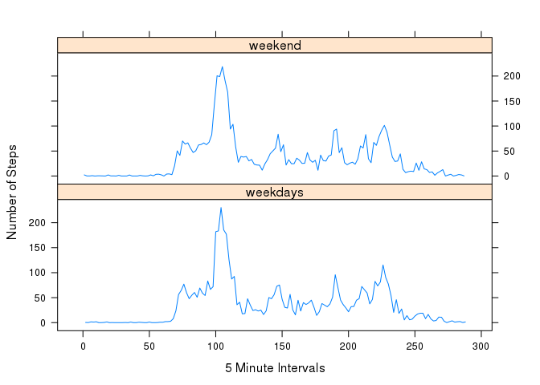

# Reproducible Research: Peer Assessment 1

<!-- This is Peer Assessment assignment 1 for Reproducible Research Coursera Course held January 5th to February 2nd 2015. --> 

## Loading and preprocessing the data 

We have a data set which contain the "walking" activity of an individual over a two-month period in 2012. 
The are three components of the data: number of steps, date, and interval. 
The steps value is an integer, a count of the number of steps the individual took on the corresponding day and interval.
The date is in year/month/day format, we have October 1st through November 30th. 
The interval is an integer, with values between 0 and 2355. These are the 288 bins created when dividing the 24 hour day into five minute intervals.  

```r
stopifnot(file.exists("./activity.csv"))
activities <- read.csv("./activity.csv", header=TRUE, sep=",")

## process (clean) the data
## convert date column from string to Date 
activities$date <- as.Date(activities$date)

### save a list of the time intervals and the dates for later use
time_intervals  <- unique(activities$interval)
time_interval_count <- length(time_intervals)
dates <- unique(activities$date)

## create sub-data.frame for the missing step data entries
## and for the non-missing entries. 
missing_data <- activities[is.na(activities$steps), ]
missing_dates <- unique(missing_data$date)
non_missing_data <- activities[!is.na(activities$steps), ]
```


## What is mean total number of steps taken per day?
We calculate the mean (10766.18) and median (10765) number of steps per day. 


```r
non_missing_dates <- unique(non_missing_data$date)

# use this list of non_missing_dates to subset the data frame 
# and calculate the step total for the day. 
calc_steps_per_day <- function(date) {
  # lapply will supply the dates we want to subset against 
  data_for_date <- non_missing_data[non_missing_data$date == date, ]
  total <- sum(data_for_date$steps)
  total
  }

steps_per_day <- unlist(lapply(non_missing_dates, calc_steps_per_day))

hist(steps_per_day, title="Histogram of steps per day")
```

```
## Warning in plot.window(xlim, ylim, "", ...): "title" is not a graphical
## parameter
```

```
## Warning in title(main = main, sub = sub, xlab = xlab, ylab = ylab, ...):
## "title" is not a graphical parameter
```

```
## Warning in axis(1, ...): "title" is not a graphical parameter
```

```
## Warning in axis(2, ...): "title" is not a graphical parameter
```

 

```r
mean(steps_per_day)
```

```
## [1] 10766.19
```

```r
median(steps_per_day)
```

```
## [1] 10765
```


## What is the average daily activity pattern?

```r
## The function factory binds the dataframe to the local variable df in the function scope
## the returned function takes a time interval (0, 5, ... 2355) 
## an entry from the third column of the dataframe
## when the returned function is called it will calculate the mean number of steps for that time interval
## the factory is used again when we need the same calculation for the weekend/weekday data. 
 mean_function_factory <- function(dataframe) {
  # TODO validate dataframe is dataframe
  df <- dataframe
  function(interval) { 
     mean(df$steps[ df$interval == interval])
  }
}

calc_step_means <- mean_function_factory(non_missing_data)
num_intervals <- length(time_intervals)
step_means <- unlist(lapply(time_intervals, calc_step_means))
plot(1:num_intervals, step_means, type="l", xlab="5 Minute Intervals", ylab="Average Step Count")
```

 

```r
max(step_means)
```

```
## [1] 206.1698
```

```r
which.max(step_means)
```

```
## [1] 104
```

```r
time_intervals[which.max(step_means)]
```

```
## [1] 835
```


## Imputing missing values
We will fill the misssing values in the Activities data, with the mean value for the corresponding 5-minute interval. 


```r
##  nrow(missing_data)
## fill in the missing data in a copy of the activities data frame
activities_filled_in <- activities
for ( interval in time_intervals ) {
  index <- match(interval,time_intervals)
  activities_filled_in[is.na(activities_filled_in$steps) & activities_filled_in$interval == interval,  ]$steps <- step_means[index]
}

#verify that we haven't changed any non-NA data
matching_rows <- activities$steps == activities_filled_in$steps
matching_rows[is.na(matching_rows)] <- FALSE
sum(matching_rows) == nrow(non_missing_data) 
```

```
## [1] TRUE
```

```r
# Matching rows count is the same as the row count for our data frame with the missing data removed.

now_missing <- activities_filled_in[is.na(activities_filled_in$steps), ]
nrow(now_missing)
```

```
## [1] 0
```

```r
calc_steps_per_day <- function(date) {
  # lapply will supply the dates we want to subset against 
  data_for_date <- activities_filled_in[activities_filled_in$date == date, ]
  total <- sum(data_for_date$steps)
  total
  }

steps_per_day <- unlist(lapply(dates, calc_steps_per_day))

hist(steps_per_day)
```

 

```r
mean(steps_per_day)
```

```
## [1] 10766.19
```

```r
median(steps_per_day)
```

```
## [1] 10766.19
```


## Are there differences in activity patterns between weekdays and weekends?
We create a new factor, called is_weekday, and add it as a column to our data. 

```r
isweekday <- function(day) {
  retval <- "weekdays"
  if ( day == "Sunday" || day == "Saturday") {
    retval <- "weekend"
  }
  retval
}
## for each date in the filled-in data frame determing the day of the week
day_of_week <- lapply(activities_filled_in$date, weekdays)
## now determine if it is a weekday or weekend day
is_weekday <- unlist(lapply(day_of_week, isweekday))
## create a factor
type_of_day <- factor(is_weekday)

num_intervals <- length(time_intervals)
## add the factor to the 
activities_filled_in <- cbind(activities_filled_in, typeofday=type_of_day)

act_on_weekends <- activities_filled_in[activities_filled_in$typeofday == "weekend", ]
calc_step_means <- mean_function_factory(act_on_weekends)
weekend_step_means <- unlist(lapply(time_intervals, calc_step_means))

act_on_weekdays <- activities_filled_in[activities_filled_in$typeofday == "weekdays", ]
calc_step_means <- mean_function_factory(act_on_weekdays)
weekday_step_means <- unlist(lapply(time_intervals, calc_step_means))
temp_df <- data.frame(intervals=1:num_intervals, weekend=weekend_step_means, weekdays=weekday_step_means )
#plot(temp_df$intervals, temp_df$weekdays, type="l")
#plot(temp_df$intervals, temp_df$weekend, type="l")
# to write plot to a file we would use dev.copy here
library(lattice)

xyplot(weekdays ~ intervals | factor(c("weekend", "weekdays")), layout=c(1,2), type="l", ylab="Number of Steps", xlab="5 Minute Intervals", data=temp_df) 
```

 
